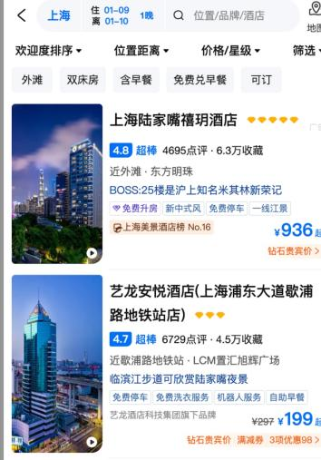
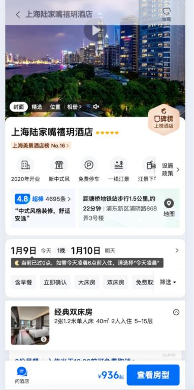

# 易宿酒店预订平台 结营大作业说明

## 五、结营大作业题目

### 1. 题目名称

易宿酒店预订平台

### 2. 题目描述

智慧出行酒店预订平台是一个面向现代旅游出行场景的综合服务体系，旨在为酒店商家与终端消费者之间搭建高效、便捷的信息交互桥梁。本项目分为两部分，分别是商户端的管理酒店信息平台和用户端的酒店预定流程页面。通过差异化的产品设计满足不同用户群体的核心诉求。

商户端平台专注于酒店信息管理与运营协作，为酒店商家提供专业化的信息录入、审核流程及发布管理能力；用户端平台则聚焦于用户体验优化，通过简洁直观的交互流程帮助用户快速找到符合需求的优质酒店。

### 3. 必须实现的功能

#### 页面汇总

##### 用户端预定流程(移动端)

- 酒店查询页(首页)
- 酒店列表页
- 酒店详情页

##### 管理酒店信息系统(PC 站点)

- 用户登录页/注册
- 酒店信息录入/编辑/修改 - **角色：商户**
- 酒店信息审核/发布/下线 - **角色：管理员**

#### 页面功能维度及相关说明

##### 酒店信息参考数据维度

##### 必须维度

- 酒店名(中/英显示)
- 酒店地址
- 酒店星级
- 酒店房型
- 酒店价格
- 酒店开业时间

##### 可选维度

- 酒店附近的热门景点、交通及商场
- 酒店价格的打折/优惠场景等（如节日优惠打8折/机票和酒店套餐减多少元等模式）

##### 用户预定流程(移动端)

| 页面名 | 功能说明 | 权重分数 | 备注 |
| ------ | -------- | -------- | ---- |
| 酒店查询页(首页) | 1. 顶部Banner: 酒店的广告,点击后直接跳转该酒店的详情页;  2. 核心查询区域:  a. 当前地点(支持定位) b. 关键字搜索 c. 酒店入住日期的选择 d. 筛选条件(酒店的星级或价格等) e. 快捷标签(各种酒店属性 如亲子,豪华,免费停车场等)  3. 查询按钮，点击后跳转到列表页 | 5 | 1. 入住日期需开发日历组件;  2. 此处的筛选条件和快捷标签如有更好的用户体验可以自行定义。 |
| 酒店列表页 | 1. 顶部核心条件筛选头:支持城市、入住/离店日期、入住间夜及搜索设置;  2. 详细筛选区域  3. 酒店列表 | 15 | 1. 详细筛选区域如有更好的用户体验可以自行定义。  2. 酒店列表需支持上滑自动加载功能 3. 酒店每一个列表项中的信息维度(酒店名/评分/地址/价格等)如有更好的用户体验可以自行定义。 |
| 酒店详情页 | 1. 顶部导航头:显示酒店名称及返回列表页功能 2. 大图Banner，支持左右滚动查看当前酒店提供的图片  3. 酒店基础信息呈现(酒店名/星级/设施/地址)  4. 日历+人间夜Banner  5. 酒店当前房型价格列表 | 15 | 1. 酒店基础信息中点评及地图可忽略不实现  2. 房型价格列表根据商户端的数据价格从低到高的排序 |

###### 管理酒店信息系统（PC 站点）- 商户端

| 页面名 | 功能说明 | 权重分数 | 备注 |
| ------ | -------- | -------- | ---- |
| 用户登录页/注册 | 账户分为商户和管理员两个角色。商户角色能上传/编辑酒店信息；管理员能审核上传及发布酒店信息 | 5 | 1. 注册界面可选择角色进行注册 2. 登录界面则无需选择角色，自动根据账号自动判断角色 |
| 酒店信息录入/编辑/修改页面 | 酒店信息录入/编辑/保存功能 | 10 | 1. 酒店的信息数据维度可参照上面提供的维度，也可以自行添加能提升用户出行体验的维度  2. 保存后的数据需实时更新到端侧 |
| 酒店信息审核发布/下线列表页面 | 酒店信息审核/发布/下线功能 | 10 | 1. 酒店信息审核状态为通过/不通过/审核中，不通过则需要显示其原因  2. 下线不是只数据的虚拟删除，它可以被恢复 |

#### 部分页面截图参考（仅供参考）

##### 酒店查询页

##### 酒店列表页

##### 酒店详情页

---

## 四、技术栈要求

- 前端: React
- 服务: Node.js

## 五、评分标准

| 评分项 | 分数 | 评分标准 | 说明 |
| ------ | ---- | -------- | ---- |
| 功能完成度 | 60 | 酒店查询页(5 分)  酒店列表页(15 分) 酒店详情页(15 分)  管理系统登录/注册(5 分) 酒店信息录入等操作(10 分)  酒店信息审核/发布/下线列表(10 分) | 主要考察各页面逻辑功能点上是否都实现，是否存在比较明显的逻辑问题。  在预定流程中用户体验如何，体验上是否有亮点 |
| 技术复杂度 | 10 | 页面数据结构是否合理，是否有实时更新价格的机制(2 分) 页面的用户体验是否流畅(5 分)  对于长列表是否有渲染优化处理(3 分) | - |
| 用户体验 | 10 | 页面视觉设计是否具有美感、布局是否合理(6 分)  页面兼容性(至少保证在组内成员手机上无明显兼容性问题)(4 分) | 良好的用户体验往往能带来更高的用户留存，包括视觉体验、交互体验，对于一个C端页面来说都是很重要的点 |
| 代码质量 | 10 | 项目结构清晰，表(存储)结构设计合理(4 分)  编码规范，良好的Readme 说明(3 分)  代码复用，通用逻辑、组件抽取(3 分) | 编码规范和清晰的项目结构在很大程度上延长了项目的生命周期，是对专业人员的基本要求。 |
| 项目创新性 | 10 | 是否采用新技术来提升研发效率和研发质量(5 分)  是否有自发设计实现有助于提升用户体验的功能点(5 分) | 鼓励大家主动从产品设计层面思考、实现一些扩展功能 |
